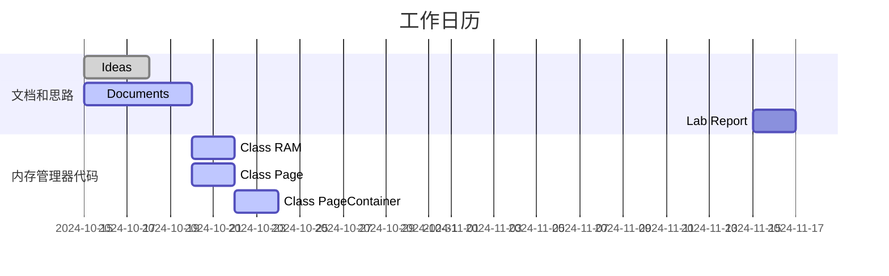

<!--
   Copyright (C) 2024  All rights reserved.

   Author        : OceanEyeFF
   Email         : fdch00@163.com
   File Name     : Project Overview.md
   Last Modified : 2024-10-21 13:58
   Describe      : 

-->

实验综述
====

### 相关信息整理

#### 实验要求

本次OS实验关注点在于实现、比较处理内存缺页的页面置换算法：
1. OPT(理论可实现)
2. FIFO
3. LRU
4. Clock Algo
5. Improved Clock Algo

主要比较点：
* 缺页率
* 平均缺页处理时间
* 页面访问时间
* 实现算法复杂度
* 多线程环境下的评估

本次OS实验中对内存管理系统有如下限定：
* 系统采用“固定分配，局部替换”策略;
* 进程逻辑地址空间的大小相同;
* 分配给进程的物理块数目相同。

本次OS实验对实验样例做出了如下要求：
1. 设计多组实验测试用于比较不同算法的性能
2. 对于每种算法实现要使用相同的页面访问序列（输入操作序列相同）

#### Linux内存管理系统基本框架

操作系统的内存管理器的基本框架：
1. 内存，虚拟内存分配与读写程序
2. 页表管理维护程序
3. 内存缺页中断处理程序
4. 内存错误处理程序
5. 内存调试追踪程序

内存管理器对系统及软件的基本接口
1. 内存管理程序：分配+管理+重分配
2. 内存池管理程序：创建内存池+内存池分配内存+销毁内存池
3. 内存权限管理
4. 内存查错
5. 内存调试（Tracing）和监控接口

#### linux环境下C++多线程程序可用的性能测试工具

1. Valgrind with helgrind
2. perf
3. gperftools(Google Performance Tools)
4. Google Benchmark

#### linux环境下可能的优化项

* 开启huge pages 并且在程序中使用使用mmap
* 编译O3优化

#### 实验设计流程

1. 实验思路整理，架构整体设计
2. 类设计、接口设计
3. C++内存控制器端程序实现
4. 测试数据格式与程序外部测试交互接口设计
5. C++ 输入测试样例交互端实现
5. C++ 数据生成程序实现
6. C++ 源代码添加性能测试程序段，性能指标数据输出
7. 多个算法性能比较，实验总结

#### 接口设计和函数设计的基本要求(TO DO: OE)

参考**Class Design.md**写类说明文档

### 系统与编译环境说明(TO DO: OE)

#### 编程环境

#### 编译环境

### 其他文档(To do OE)

1. 架构设计文档 Structure Design.md
2. 接口描述文档 Class Design Document/
3. 代码注释文档 
4. 文档编写规范文档 Project Develop Document/

### 工作日历(To do OE)

10月15日项目开始

